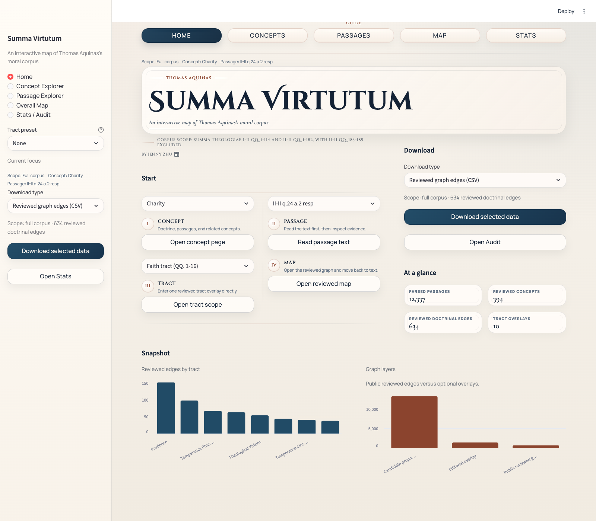
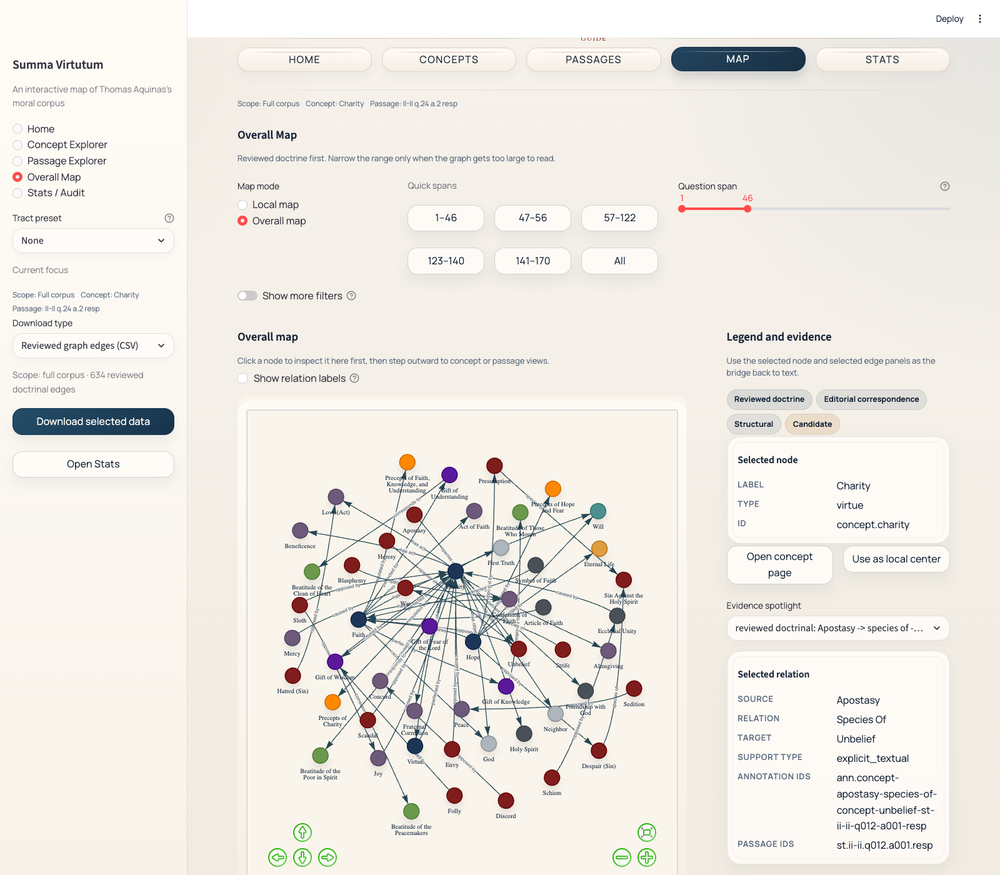

# Summa Virtutum

An interactive map of Thomas Aquinas's moral corpus.

[](https://summa-moral-graph.streamlit.app/)


| Open now | Companion project |
| --- | --- |
| [**Live viewer**](https://summa-moral-graph.streamlit.app/) | [**Summa Virtue Alignment**](https://github.com/hanzhenzhujene/summa-virtue-alignment) |
| Reader-first dashboard for concepts, passages, tract overlays, and doctrinal maps. | Later downstream SFT project built from this graph, corpus, and reviewed-evidence workflow. |

> Source: [GitHub](https://github.com/hanzhenzhujene/summa-moral-graph) · Docs: [Viewer audit](./docs/dashboard_interaction_audit.md) · by [Jenny Zhu](https://www.linkedin.com/in/hanzhen-zhu/)

> In the Summa article form — [obj](https://en.wikipedia.org/wiki/Summa_Theologica), [sc](https://en.wikipedia.org/wiki/Summa_Theologica), [resp](https://en.wikipedia.org/wiki/Summa_Theologica), [ad](https://en.wikipedia.org/wiki/Summa_Theologica) — this viewer keeps only `resp` and `ad`: Thomas's own answer. No opening objections are included.

## At A Glance

| Start from a concept | Start from a passage | Start from the map |
| --- | --- | --- |
| Read distinction notes, reviewed doctrinal edges, and supporting passages. | Search segment text first, then inspect the reviewed and candidate material attached to one passage. | Move between local concept maps and the overall doctrinal map without losing evidence. |

Layer separation stays visible throughout: reviewed doctrine, editorial correspondences,
structural links, and candidate proposals.

## Open The Viewer

**Live app:** [summa-moral-graph.streamlit.app](https://summa-moral-graph.streamlit.app/)

The Streamlit entrypoint is [`streamlit_app.py`](./streamlit_app.py).

| Dashboard home | Overall map |
| --- | --- |
|  |  |
| _Landing view with concept, passage, tract, and map entry routes._ | _Graph view with doctrinal edges, evidence panel, and current-slice controls._ |

## What This Viewer Does

| Read one concept closely | Start from the text | Move through the graph |
| --- | --- | --- |
| Open a concept page, read distinction notes, inspect reviewed doctrinal edges, and open the supporting passages. | Search passages directly, read segment text first, then inspect reviewed and candidate material attached to that passage. | Switch between local concept maps and the overall doctrinal map without losing relation labels, evidence, or layer distinctions. |

## Try This First

1. Launch the dashboard locally.
2. Open `Concept Explorer` and start from a tract-centered concept such as `prudence`, `justice`, `religion`, or `temperance`.
3. Read the supporting passage cards before opening the wider map.
4. Use the local concept map to move to a neighboring concept.
5. Open `Overall Map` when you want the wider doctrinal slice.

## What This Project Is

`summa-moral-graph` is an evidence-first research workspace and Streamlit dashboard for the
moral-philosophical corpus of Thomas Aquinas's *Summa Theologiae*.

It is built to help a reader move through four connected layers without losing textual grounding:

1. concept
2. relation
3. passage
4. graph

The project is not a vague summary graph. It preserves segment-level evidence, stable ids, and
clear separation between reviewed doctrine, editorial correspondences, structural links, and
candidate review material.

## What You Can Do Here

The unified Streamlit app lets you:

- start from a concept, passage, tract scope, or graph view
- move from concept pages to supporting passages and back again
- inspect reviewed doctrinal edges first, with editorial and candidate layers kept visibly separate
- open local concept maps and broader overall maps
- browse tract overlays without losing evidence traceability
- export the current graph slice or dashboard data directly from the UI

Primary views in the app:

- `Home`
- `Concept Explorer`
- `Passage Explorer`
- `Overall Map`
- `Stats / Audit`

## Run The Dashboard

Use Python `3.12` if possible.

```bash
python3.12 -m venv .venv
source .venv/bin/activate
pip install -e ".[dev]"
PYTHONPATH=src ./.venv/bin/streamlit run streamlit_app.py
```

Or:

```bash
make app
```

Then open:

- [http://localhost:8501](http://localhost:8501)

The Streamlit entrypoint is:

- [`streamlit_app.py`](./streamlit_app.py)

If you just want the app and not the full maintainer workflow, this is the only command path you
need.

## Deploy From GitHub With Streamlit

If you want the app hosted publicly from GitHub, the right target is **Streamlit Community Cloud**,
not GitHub Pages.

Why:

- GitHub Pages is for static sites
- this dashboard is a Python Streamlit app
- it needs a live Python runtime, package install, and server-side execution

Recommended deployment path:

1. Push this repository to GitHub.
2. Go to [Streamlit Community Cloud](https://share.streamlit.io/).
3. Click **New app**.
4. Choose:
   - repository: `hanzhenzhujene/summa-moral-graph`
   - branch: `main`
   - main file path: `streamlit_app.py`
5. Deploy.

Once deployed, Streamlit gives you a fixed app URL like:

- `https://<your-app-name>.streamlit.app`

Streamlit's sharing docs:

- [Run your Streamlit app](https://docs.streamlit.io/develop/concepts/architecture/run-your-app)
- [Share your app](https://docs.streamlit.io/deploy/streamlit-community-cloud/share-your-app)

After it is live, add the Streamlit badge to the top of this README:

```md
[](https://<your-app-name>.streamlit.app)
```

### Optional: keep the deployed app warm

This repo includes a small GitHub Actions workflow at
[`/.github/workflows/streamlit-keep-alive.yml`](./.github/workflows/streamlit-keep-alive.yml).

What it does:

- runs on a schedule every 4 hours, offset from the top of the hour to avoid the busiest cron slot
- can also be started manually from the GitHub Actions tab
- opens the deployed app in headless Chromium with Playwright
- if Streamlit shows the sleeping page, clicks `Yes, get this app back up!`
- waits for the real dashboard title or embedded app frame to load, which is much closer to a real
  user visit than a bare healthcheck or curl probe

What to set:

- add `STREAMLIT_APP_URL` as either:
  - a GitHub repository **secret**
  - or a GitHub repository **variable**
- example value: `https://summa-moral-graph.streamlit.app/`

Notes and limitations:

- this is still only a best-effort keep-awake workflow, not a guaranteed uptime mechanism
- Streamlit Community Cloud may still sleep, restart, queue, or behave differently depending on
  platform policy
- this workflow depends on the current sleeping-page button text and landing-page copy, so if
  Streamlit or this app changes those surfaces, the script may need a small update
- Streamlit renders the actual dashboard in an embedded app frame, so the keep-awake script checks
  both the page title and the child app frame instead of relying only on the top-level document
- this approach is intentionally browser-based because Streamlit community discussions indicate that
  backend health probes alone may not count as a real visit; a simulated browser visit is more
  faithful to how the app actually wakes
- if `STREAMLIT_APP_URL` is not configured, the workflow fails clearly instead of silently doing
  nothing

### Important: Community Cloud still hibernates after 12 hours

Streamlit's own docs now say:

- "All apps without traffic for 12 hours go to sleep."
- "To keep your app awake, simply visit your app."

Official references:

- [Manage your app → App hibernation](https://docs.streamlit.io/deploy/streamlit-community-cloud/manage-your-app)
- [Community discussion confirming the 12-hour threshold](https://discuss.streamlit.io/t/web-apps-keeps-on-sleeping-after-30-minutes-or-a-day-of-inactivity/97350)
- [Community discussion noting that real or simulated user visits are more reliable than simple backend checks](https://discuss.streamlit.io/t/app-sleeps-after-2-days-of-no-traffic-instead-of-7-days/66866)

In practice, the GitHub Actions keep-alive workflow in this repo is only a best-effort probe. It is
not a supported way to guarantee that Streamlit Community Cloud will keep the app awake.

If you need the app to stay reliably available, the better answer is to move the same Streamlit app
to an always-on host instead of trying to fight Community Cloud hibernation.

## Recommended no-sleep deployment: Docker + Railway persistent service

This repo now includes a [`Dockerfile`](./Dockerfile), so you can deploy the same Streamlit app to
an always-on container host without rewriting the app.

It also now includes a root [`railway.json`](./railway.json), so Railway can pick up the intended
deployment settings from the repo itself.

The cleanest low-friction option here is a **Railway persistent service**:

- Railway services are container-based deployment targets
- Railway distinguishes between **persistent services** and **Serverless**
- this repo's `railway.json` explicitly sets `sleepApplication: false`
- if a `Dockerfile` exists, Railway will build from it automatically

Official references:

- [Railway services](https://docs.railway.com/services)
- [Railway serverless](https://docs.railway.com/deployments/serverless)
- [Railway restart policy](https://docs.railway.com/deployments/restart-policy)
- [Railway config as code](https://docs.railway.com/config-as-code)

Recommended settings on Railway:

1. Create a new project from this GitHub repo.
2. Let Railway build from the repo's `Dockerfile`.
3. Railway should automatically read [`railway.json`](./railway.json) on deploy.
4. Confirm in Railway settings that **Serverless / App Sleeping is off**.
5. Confirm the healthcheck path is `/_stcore/health`.
6. On a paid plan, you can optionally change restart policy from `On Failure` to `Always`.

What `railway.json` currently configures:

- Dockerfile build
- healthcheck path: `/_stcore/health`
- healthcheck timeout: `300`
- sleeping disabled: `sleepApplication: false`
- conservative restart policy: `ON_FAILURE`

### Railway deploy path

The simplest deploy flow is:

1. Go to [Railway](https://railway.com/).
2. Create a new project.
3. Choose **Deploy from GitHub repo**.
4. Select `hanzhenzhujene/summa-moral-graph`.
5. Let Railway detect the root `Dockerfile`.
6. After the first deploy, open the service:
   - `Settings`
   - verify that the config picked up:
     - `sleepApplication: false`
     - healthcheck path `/_stcore/health`
7. Open the generated Railway domain and confirm the app loads.

This keeps the Streamlit app itself unchanged. You are changing the hosting model, not rebuilding
the dashboard in another framework.

## Corpus Scope

The textual spine currently covers:

- `I-II, qq. 1–114`
- `II-II, qq. 1–182`

Explicit exclusions:

- `II-II, qq. 183–189`
- `Part I`
- `Part III`
- `Supplement`

Current usable corpus size:

- `296` questions
- `1482` articles
- `6032` doctrinally usable passages (`resp` + `ad` only)

## Current Reviewed Coverage

The repo does **not** claim the whole corpus is doctrinally reviewed.

It currently includes reviewed overlays for:

- pilot vertical slice across selected `I-II` and `II-II` questions
- theological virtues: `II-II, qq. 1–46`
- prudence: `II-II, qq. 47–56`
- justice core: `II-II, qq. 57–79`
- religion tract: `II-II, qq. 80–100`
- owed-relation tract: `II-II, qq. 101–108`
- connected virtues: `II-II, qq. 109–120`
- fortitude parts and closure: `II-II, qq. 129–140`
- temperance: `II-II, qq. 141–170`

The repo also keeps a full-corpus candidate workflow for:

- structural coverage audit
- candidate concept mentions
- candidate relation proposals
- review packets and review queues

Questions `II-II, qq. 121–128` remain structurally available in the corpus but do not yet have
their own dedicated reviewed doctrinal block.

## Evidence Discipline

This repository is designed around a few non-negotiable rules:

- the canonical evidence unit is the segment, not the whole article
- stable ids remain the anchor for every exported record
- reviewed doctrine, editorial correspondences, structural links, and candidate material stay
  separate in data, validation, and UI
- candidate material is never auto-promoted into reviewed doctrine
- alias handling is conservative, especially where one English label could hide multiple Thomistic
  concepts

In practice, that means the app defaults to reviewed doctrinal graph material, and users opt into
editorial, structural, or candidate overlays only when they want them.

## Quickstart

If you want the full repo in editable local mode first:

```bash
python3.12 -m venv .venv
source .venv/bin/activate
pip install -e ".[dev]"
```

## Build And Validate

If you want the full structural and candidate workflow:

```bash
make build-interim
make validate-interim
make build-corpus
make validate-candidates
make review-corpus
```

If you want the dashboard and reviewed overlays in a ready-to-use local state:

```bash
make build-interim
make build-corpus
make validate-candidates
make build-pilot
make validate-pilot
make build-prudence
make build-theological-virtues
make test
```

Useful direct commands:

```bash
summa-moral-graph build-interim
summa-moral-graph validate-interim
summa-moral-graph build-corpus
summa-moral-graph validate-candidates
summa-moral-graph build-pilot
summa-moral-graph validate-pilot
summa-moral-graph build-prudence
summa-moral-graph validate-prudence
summa-moral-graph build-theological-virtues
summa-moral-graph validate-theological-virtues
python scripts/build_corpus_workflow.py
python scripts/build_corpus_review_queue.py
```

## Most Useful Docs

- Schema: [docs/schema.md](./docs/schema.md)
- Annotation guide: [docs/annotation_guide.md](./docs/annotation_guide.md)
- Normalization guide: [docs/normalization.md](./docs/normalization.md)
- Full-corpus workflow: [docs/full_corpus_workflow.md](./docs/full_corpus_workflow.md)
- Review queue guide: [docs/review_queue_guide.md](./docs/review_queue_guide.md)
- Coverage summary: [docs/coverage_summary.md](./docs/coverage_summary.md)
- Dashboard interaction audit: [docs/dashboard_interaction_audit.md](./docs/dashboard_interaction_audit.md)

## Important Outputs

The most important generated material lives under:

- `data/interim/` for parsed textual structure
- `data/gold/` for reviewed concepts and annotations
- `data/candidate/` for unreviewed concept and relation proposals
- `data/processed/` for coverage, validation, graph exports, and synthesis artifacts

Examples:

- `data/processed/corpus_manifest.json`
- `data/processed/coverage_report.json`
- `data/processed/candidate_validation_report.json`
- `data/processed/fortitude_tract_synthesis.graphml`
- `data/processed/temperance_full_synthesis.graphml`

## Dashboard Architecture

The current app is a unified Streamlit shell rooted at [`streamlit_app.py`](./streamlit_app.py).

The newer viewer layer lives under:

- `src/summa_moral_graph/viewer/`

That shared layer now drives:

- shared session state
- cross-view navigation
- concept, passage, and map transitions
- tract adapter registration
- reusable UI rendering helpers

Legacy files in `app/Home.py` and `app/pages/*` remain as compatibility wrappers rather than the
main dashboard architecture.

## Status

This repository is in active research use, but the dashboard and evidence model are now organized
as a polished, reader-facing product rather than a loose prototype.

The right way to read the current state is:

- the structural corpus is broad
- the reviewed doctrinal layer is substantial but partial
- the candidate layer is there to support human review, not to pretend to be finished doctrine

That separation is deliberate, and it is one of the main guarantees of the project.
